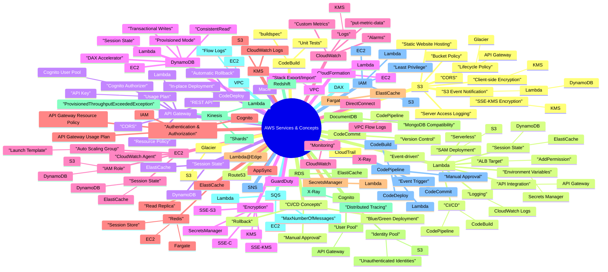

```mermaid
mindmap
  root((AWS Services & Concepts))
    S3
      "Static Website Hosting"
      "Server Access Logging"
      "S3 Event Notification"
        Lambda
          DynamoDB
      "SSE-KMS Encryption"
        KMS
      "Lifecycle Policy"
        Glacier
      "Bucket Policy"
      "CORS"
        API Gateway
      "Client-side Encryption"
        KMS
    Lambda
      "Serverless"
      "Event-driven"
      "Logging"
        CloudWatch Logs
      "Environment Variables"
        Secrets Manager
      "API Integration"
        API Gateway
      "ALB Target"
        "AddPermission"
      "SAM Deployment"
        S3
      "CI/CD"
        CodePipeline
        CodeBuild
      "Session State"
        ElastiCache
        DynamoDB
    API Gateway
      "REST API"
      "Resource Policy"
      "Usage Plan"
        "API Key"
      "CORS"
      "Cognito Authorizer"
        Cognito User Pool
      Lambda
    DynamoDB
      "Provisioned Mode"
      "ConsistentRead"
      "Transactional Writes"
      "DAX Accelerator"
      "Session State"
      EC2
      Lambda
    EC2
      "Auto Scaling Group"
        "Launch Template"
      "IAM Role"
        DynamoDB
        S3
      "CloudWatch Agent"
      "Session State"
        ElastiCache
        DynamoDB
    ElastiCache
      "Redis"
        "Session Store"
        Fargate
        EC2
      "Read Replica"
    Fargate
      ElastiCache
    Cognito
      "Identity Pool"
        "Unauthenticated Identities"
        S3
      "User Pool"
        API Gateway
    Kinesis
      Lambda
      "Shards"
      "ProvisionedThroughputExceededException"
    SQS
      Lambda
      EC2
      "MaxNumberOfMessages"
    CodePipeline
      CodeBuild
      CodeDeploy
      CodeCommit
      Lambda
      "Manual Approval"
      "Event Trigger"
    CodeBuild
      "buildspec"
      "Unit Tests"
    CodeCommit
      "Version Control"
      CodePipeline
    CodeDeploy
      "In-place Deployment"
      "Automatic Rollback"
    CloudFormation
      "Stack Export/Import"
        VPC
      Lambda
      EC2
    CloudWatch
      "Custom Metrics"
      "put-metric-data"
      "Alarms"
      "Logs"
        KMS
    KMS
      S3
      CloudWatch Logs
    SecretsManager
      Lambda
    RDS
      ElastiCache
    X-Ray
      "Distributed Tracing"
    VPC
      EC2
      "Flow Logs"
    IAM
      EC2
      S3
      Lambda
      "Least Privilege"
    Glacier
      S3
    Route53
    Macie
    GuardDuty
    DirectConnect
    AppSync
    Lambda@Edge
    DocumentDB
      "MongoDB Compatibility"
    Redshift
    DAX
    SNS
    CloudTrail
    "CI/CD Concepts"
      "Blue/Green Deployment"
      "Manual Approval"
      "Rollback"
    "Session State"
      ElastiCache
      DynamoDB
    "Encryption"
      KMS
      SSE-KMS
      SSE-S3
      SSE-C
      SecretsManager
    "Monitoring"
      CloudWatch
      X-Ray
      VPC Flow Logs
    "Authentication & Authorization"
      Cognito
      IAM
      API Gateway Resource Policy
      API Gateway Usage Plan
```