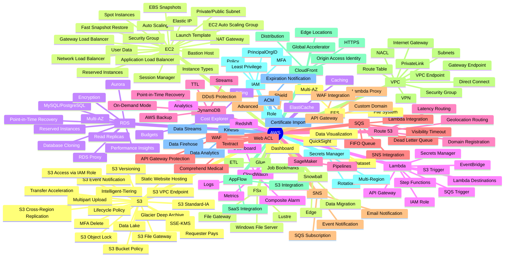
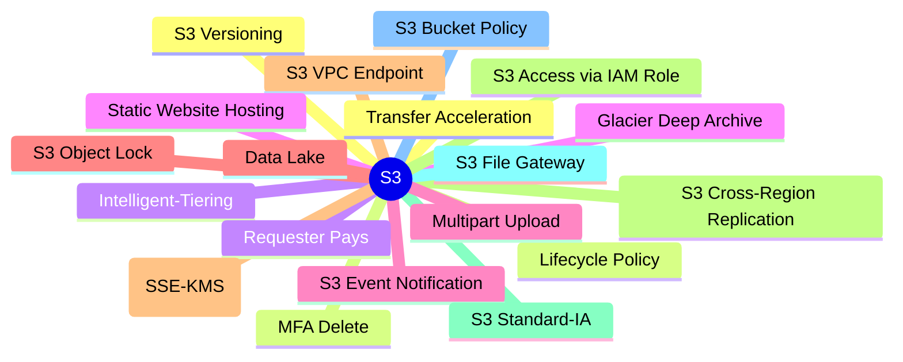
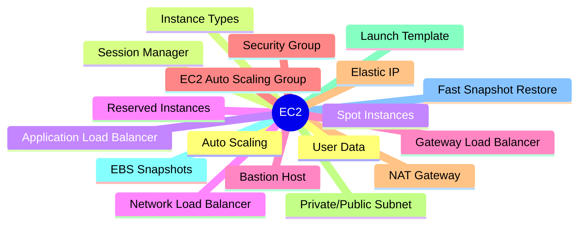
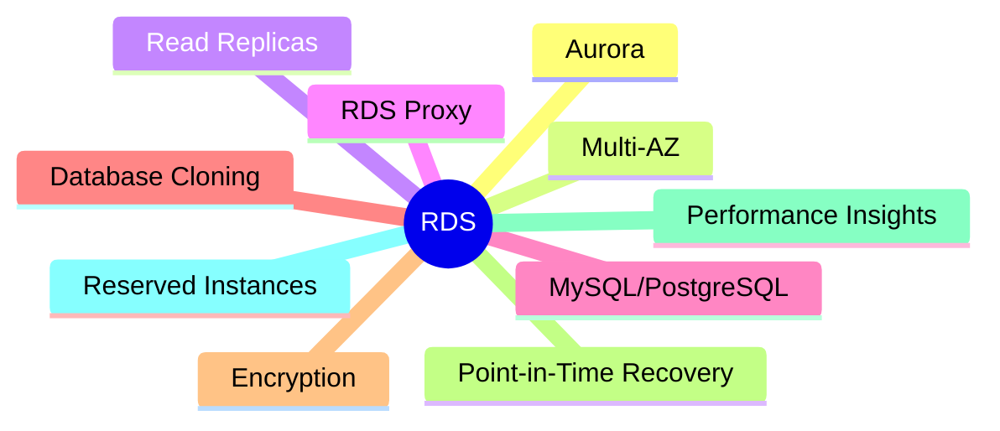

# Mindmaps AWS - Geral

_Gerado em: 2026-01-11_

## Mindmap Geral

```mermaid
mindmap
  root((AWS))
    S3
      Transfer Acceleration
      Lifecycle Policy
      Intelligent-Tiering
      Glacier Deep Archive
      S3 Event Notification
      S3 Object Lock
      S3 VPC Endpoint
      S3 Cross-Region Replication
      S3 Standard-IA
      S3 File Gateway
      S3 Bucket Policy
      S3 Versioning
      MFA Delete
      Requester Pays
      Static Website Hosting
      Multipart Upload
      Data Lake
      Encryption (SSE-KMS)
      S3 Access via IAM Role
    EC2
      Auto Scaling
      Instance Types
      Spot Instances
      Reserved Instances
      Bastion Host
      Security Group
      NAT Gateway
      Private/Public Subnet
      Launch Template
      EBS Snapshots
      Fast Snapshot Restore
      User Data
      Session Manager
      Application Load Balancer
      Network Load Balancer
      Gateway Load Balancer
      EC2 Auto Scaling Group
      Elastic IP
    RDS
      Aurora
      Multi-AZ
      Read Replicas
      RDS Proxy
      MySQL/PostgreSQL
      Database Cloning
      Encryption
      Point-in-Time Recovery
      Performance Insights
      Reserved Instances
    Lambda
      S3 Trigger
      SQS Trigger
      EventBridge
      API Gateway
      Step Functions
      Secrets Manager
      IAM Role
      Lambda Destinations
    DynamoDB
      Streams
      Point-in-Time Recovery
      On-Demand Mode
      TTL
      AWS Backup
    SQS
      FIFO Queue
      Dead Letter Queue
      Visibility Timeout
      SNS Integration
      Lambda Integration
    SNS
      SQS Subscription
      Email Notification
      Event Notification
    VPC
      Subnets
      Route Table
      VPC Endpoint
      Security Group
      NACL
      Direct Connect
      VPN
      PrivateLink
      Gateway Endpoint
      Internet Gateway
    CloudFront
      Distribution
      Origin Access Identity
      Global Accelerator
      Edge Locations
      HTTPS
    IAM
      Role
      Policy
      PrincipalOrgID
      Least Privilege
      MFA
    Kinesis
      Data Streams
      Data Firehose
      Data Analytics
    QuickSight
      Dashboard
      Data Visualization
      Dataset
    FSx
      Windows File Server
      Lustre
      File Gateway
    Cost Explorer
      Budgets
      Billing
    CloudWatch
      Dashboard
      Composite Alarm
      Logs
      Metrics
    Route 53
      Latency Routing
      Geolocation Routing
      Domain Registration
    WAF
      Web ACL
      API Gateway Protection
    Shield
      DDoS Protection
      Advanced
    Glue
      ETL
      Job Bookmarks
    AppFlow
      SaaS Integration
      S3 Integration
    Secrets Manager
      Rotation
      Multi-Region
    ACM
      Certificate Import
      Expiration Notification
    EFS
      Multi-AZ
      File System
    Snowball
      Edge
      Data Migration
    ElastiCache
      Caching
    Redshift
      Analytics
    SageMaker
      Pipelines
    Textract
      Comprehend Medical
    API Gateway
      Custom Domain
      Lambda Proxy
      WAF Integration
```

---

## Mindmaps Parciais

### S3

```mermaid
mindmap
  root((S3))
    Transfer Acceleration
    Lifecycle Policy
    Intelligent-Tiering
    Glacier Deep Archive
    S3 Event Notification
    S3 Object Lock
    S3 VPC Endpoint
    S3 Cross-Region Replication
    S3 Standard-IA
    S3 File Gateway
    S3 Bucket Policy
    S3 Versioning
    MFA Delete
    Requester Pays
    Static Website Hosting
    Multipart Upload
    Data Lake
    Encryption (SSE-KMS)
    S3 Access via IAM Role
```

### EC2

```mermaid
mindmap
  root((EC2))
    Auto Scaling
    Instance Types
    Spot Instances
    Reserved Instances
    Bastion Host
    Security Group
    NAT Gateway
    Private/Public Subnet
    Launch Template
    EBS Snapshots
    Fast Snapshot Restore
    User Data
    Session Manager
    Application Load Balancer
    Network Load Balancer
    Gateway Load Balancer
    EC2 Auto Scaling Group
    Elastic IP
```

### RDS

```mermaid
mindmap
  root((RDS))
    Aurora
    Multi-AZ
    Read Replicas
    RDS Proxy
    MySQL/PostgreSQL
    Database Cloning
    Encryption
    Point-in-Time Recovery
    Performance Insights
    Reserved Instances
```
