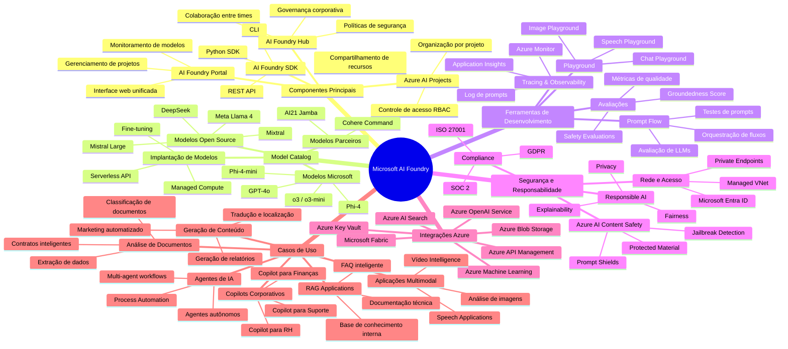

```mermaid
mindmap
  root((Microsoft AI Foundry))
    Componentes Principais
      AI Foundry Portal
        Interface web unificada
        Gerenciamento de projetos
        Monitoramento de modelos
      AI Foundry SDK
        Python SDK
        REST API
        CLI
      Azure AI Projects
        Organização por projeto
        Controle de acesso RBAC
        Compartilhamento de recursos
      AI Foundry Hub
        Governança corporativa
        Políticas de segurança
        Colaboração entre times
    Model Catalog
      Modelos Microsoft
        GPT-4o
        o3 / o3-mini
        Phi-4
        Phi-4-mini
      Modelos Open Source
        Meta Llama 4
        Mistral Large
        Mixtral
        DeepSeek
      Modelos Parceiros
        Cohere Command
        AI21 Jamba
      Implantação de Modelos
        Serverless API
        Managed Compute
        Fine-tuning
    Ferramentas de Desenvolvimento
      Prompt Flow
        Orquestração de fluxos
        Testes de prompts
        Avaliação de LLMs
      Playground
        Chat Playground
        Image Playground
        Speech Playground
      Avaliações
        Métricas de qualidade
        Safety Evaluations
        Groundedness Score
      Tracing & Observability
        Azure Monitor
        Application Insights
        Log de prompts
    Segurança e Responsabilidade
      Azure AI Content Safety
        Prompt Shields
        Jailbreak Detection
        Protected Material
      Responsible AI
        Fairness
        Explainability
        Privacy
      Compliance
        GDPR
        ISO 27001
        SOC 2
      Rede e Acesso
        Private Endpoints
        Managed VNet
        Microsoft Entra ID
    Integrações Azure
      Azure OpenAI Service
      Azure AI Search
      Azure Machine Learning
      Azure Blob Storage
      Azure Key Vault
      Azure API Management
      Microsoft Fabric
    Casos de Uso
      Copilots Corporativos
        Copilot para RH
        Copilot para Finanças
        Copilot para Suporte
      RAG Applications
        Base de conhecimento interna
        Documentação técnica
        FAQ inteligente
      Geração de Conteúdo
        Marketing automatizado
        Geração de relatórios
        Tradução e localização
      Análise de Documentos
        Contratos inteligentes
        Extração de dados
        Classificação de documentos
      Agentes de IA
        Agentes autônomos
        Multi-agent workflows
        Process Automation
      Aplicações Multimodal
        Análise de imagens
        Vídeo Intelligence
        Speech Applications
```