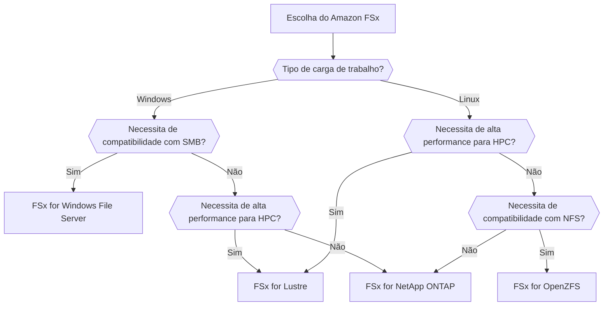

Abaixo, um diagrama Amazon FSx mostrando uma árvore de decisão para escolher entre as diferentes opções de sistemas de arquivos gerenciados pela AWS.

```mermaid
graph TD
    A[Escolha do Amazon FSx] --> B{{Tipo de carga de trabalho?}}
    B -- Windows --> C{{Necessita de compatibilidade com SMB?}}
    C -- Sim --> D[FSx for Windows File Server]
    C -- Não --> E{{Necessita de alta performance para HPC?}}
    E -- Sim --> F[FSx for Lustre]
    E -- Não --> G[FSx for NetApp ONTAP]
    B -- Linux --> H{{Necessita de alta performance para HPC?}}
    H -- Sim --> F[FSx for Lustre]
    H -- Não --> I{{Necessita de compatibilidade com NFS?}}
    I -- Sim --> J[FSx for OpenZFS]
    I -- Não --> G[FSx for NetApp ONTAP]
```

