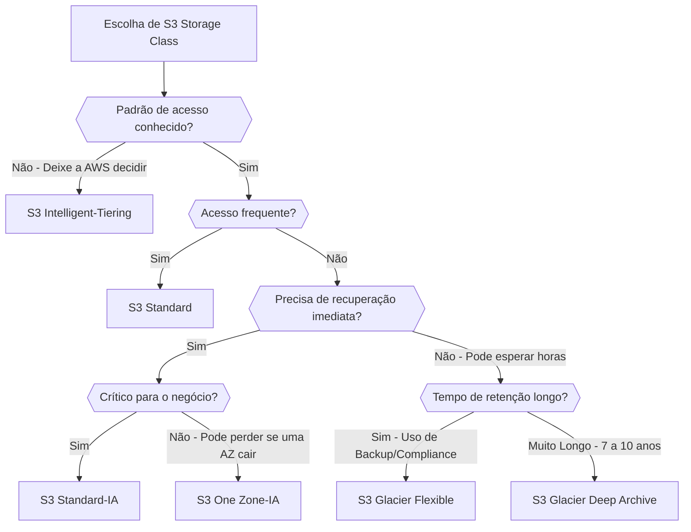

```mermaid
graph TD
    A[Escolha de S3 Storage Class] --> B{{Padrão de acesso conhecido?}}
    B -- Não - Deixe a AWS decidir --> C[S3 Intelligent-Tiering]
    B -- Sim --> D{{Acesso frequente?}}
    D -- Sim --> E[S3 Standard]
    D -- Não --> F{{Precisa de recuperação imediata?}}
    F -- Sim --> G{{Crítico para o negócio?}}
    G -- Sim --> H[S3 Standard-IA]
    G -- Não - Pode perder se uma AZ cair --> I[S3 One Zone-IA]
    F -- Não - Pode esperar horas --> J{{Tempo de retenção longo?}}
    J -- Sim - Uso de Backup/Compliance --> K[S3 Glacier Flexible]
    J -- Muito Longo - 7 a 10 anos --> L[S3 Glacier Deep Archive]
```