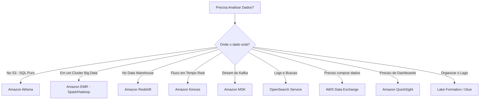
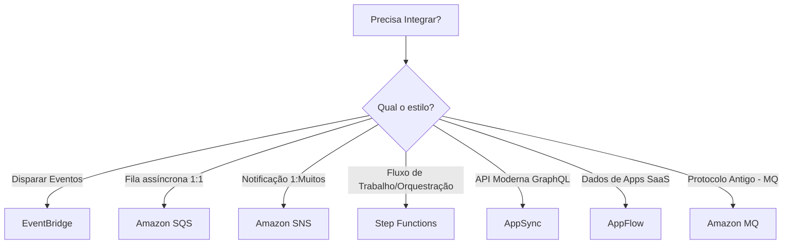
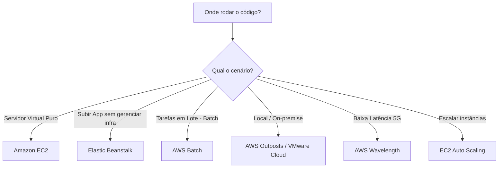
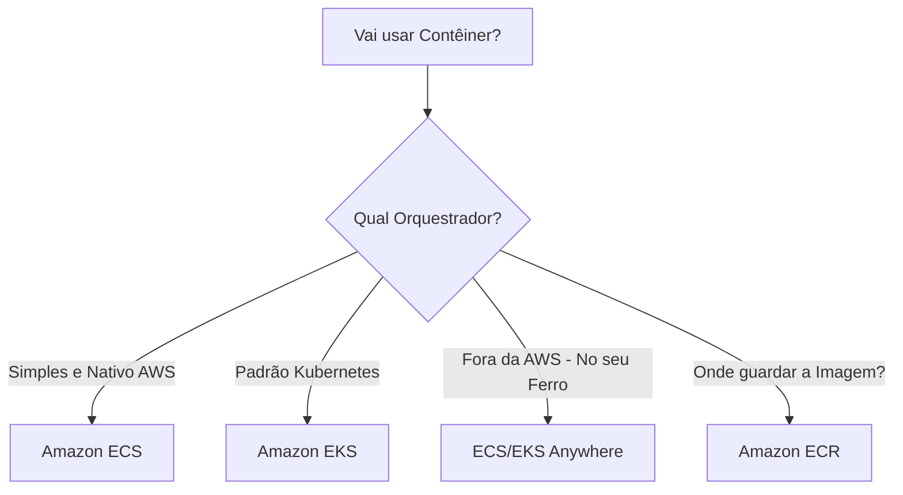
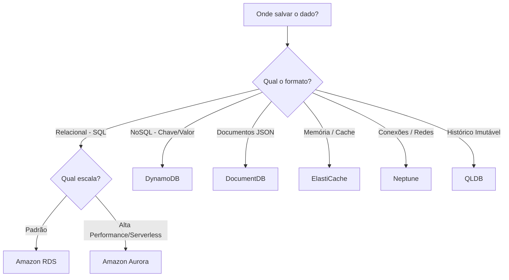
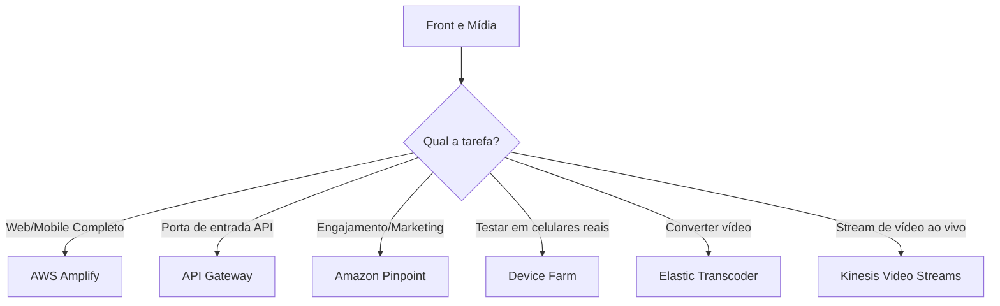
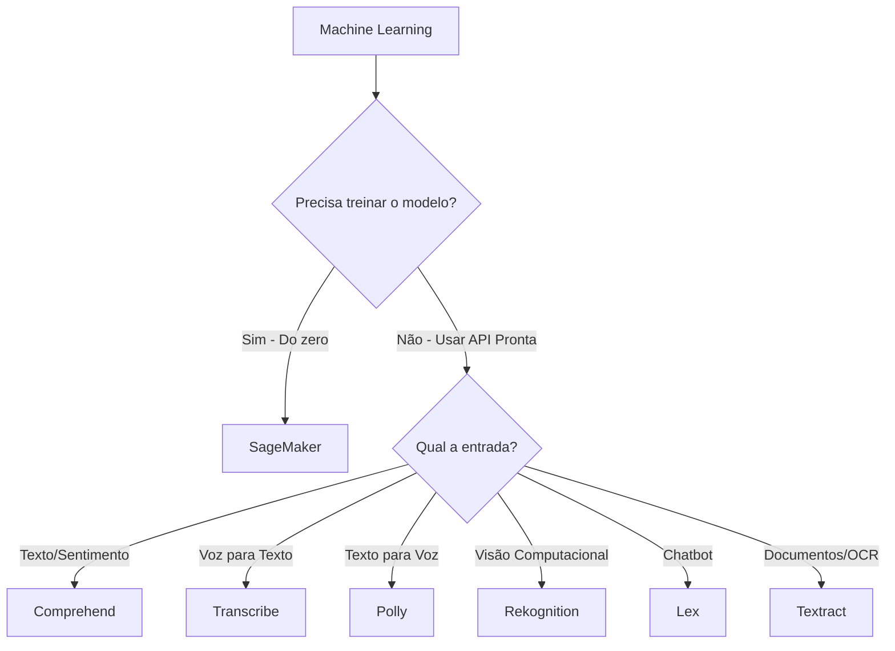
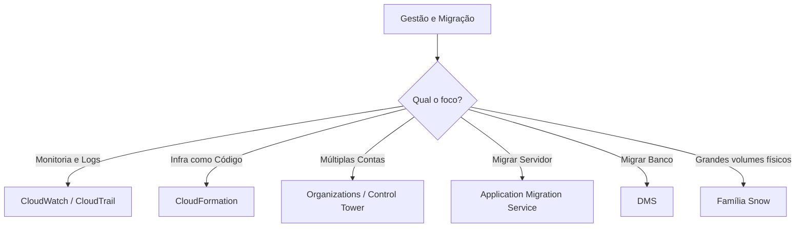
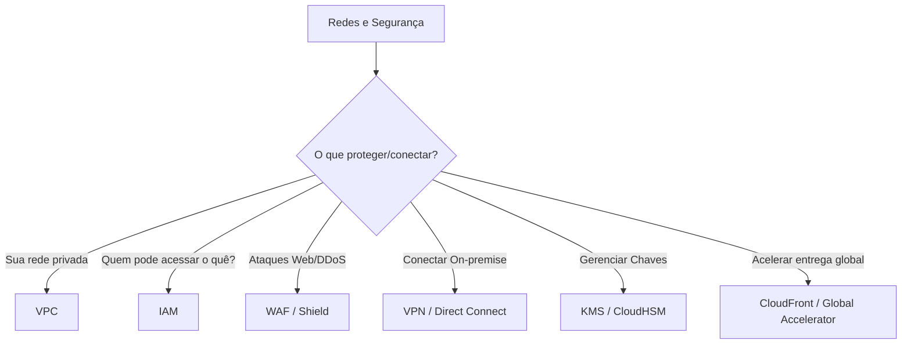
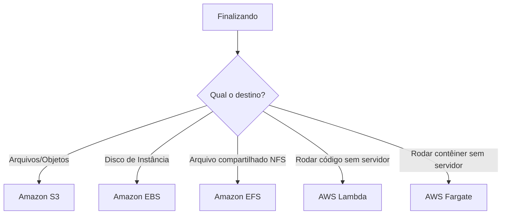

# Decision trees - AWS Services

1. Analíticos: Onde os dados ganham vida

2. Integração: O diálogo dos sistemas

3. Computação: O motor da nuvem

4. Contêineres: A caixa mágica

5. Bancos: O cofre do conhecimento

6. Front e Mídia: A cara do sistema

7. Machine Learning: O robô sabido

8. Gerenciamento e Migração: Ordem na casa

9. Redes e Segurança: O muro e a estrada

10. Armazenamento e Serverless: O celeiro e a leveza

