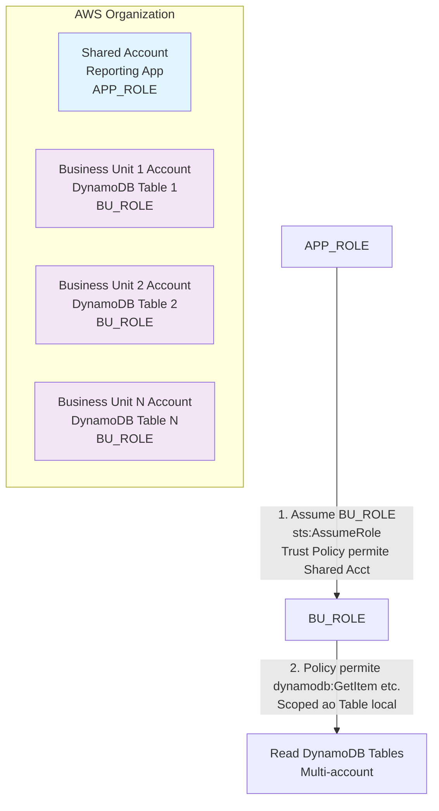

### Acesso Cross-Account ao Amazon DynamoDB

Cross-account access ao Amazon DynamoDB é uma prática que permite que uma aplicação em uma conta AWS acesse tabelas DynamoDB localizadas em outras contas AWS. Isso é útil em cenários onde diferentes unidades de negócios ou equipes possuem suas próprias contas AWS, mas precisam compartilhar dados de forma segura e controlada.

----
