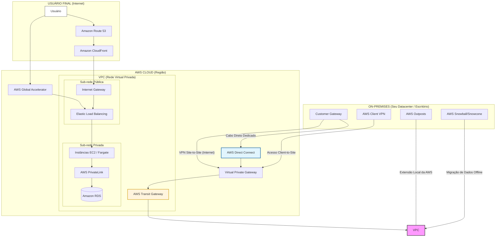
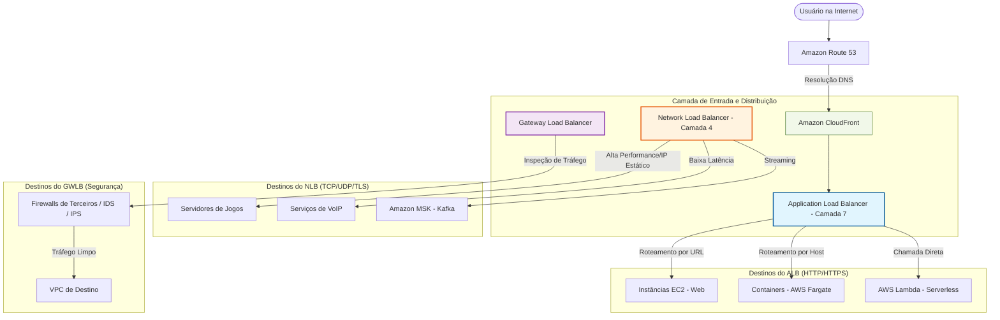
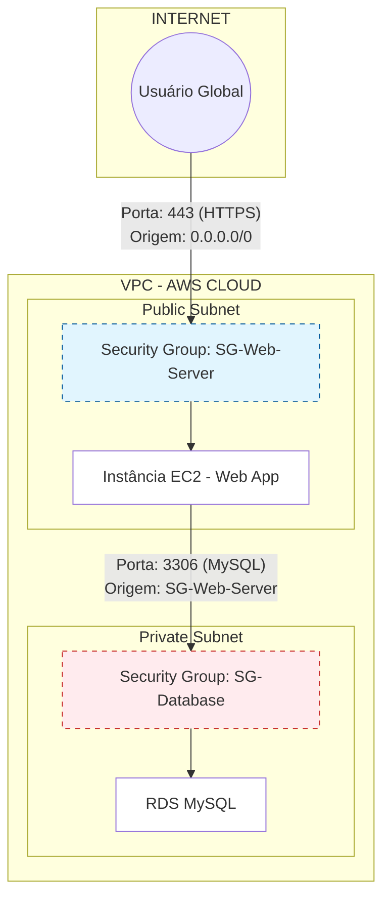

## O Repente dos Analíticos

**(Intro: Som de viola batida no ritmo de galope à beira-mar)**

### I. A Abertura

Vou cantar com consciência
Nesta rima improvisada
Pra explicar pra vocês
A nuvem bem organizada
São os serviços da Amazon
Pra sua mente ficar ligada!

### II. Athena e Data Exchange

Começo com o **Athena**
Que é ligeiro e atrevido
Faz consulta no S3
Sem precisar de um servidor partido
Usa o SQL padrão
E o resultado é garantido!

Já o **Data Exchange**
É uma feira, um mercado
Lá você busca o dado externo
Que já vem empacotado
Pra enriquecer seu negócio
Sem o dado ficar parado.

### III. Data Pipeline e EMR

O **Data Pipeline**
É o mestre do movimento
Leva o dado de um lugar
Pro outro, com agendamento
Seja on-premise ou na nuvem
Faz o processamento.

Mas se o dado é pesado
E o volume é de assombrar
O **Amazon EMR**
É quem vem pra trabalhar
Usa Spark, usa Hadoop
Pro "Big Data" analisar.

### IV. Glue e Kinesis

O **AWS Glue**
É o "grude" do saber
Faz o ETL moderno
Pro dado não se perder
Catálogo inteligente
Pro seu lago florescer!

Se o dado vem num rio
Correndo em tempo real
O **Amazon Kinesis**
É a ferramenta ideal
Captura, processa e entrega
Num fluxo fenomenal!

### V. Lake Formation e MSK

Pra montar o seu "Lago"
Sem medo de confusão
Tem o **Lake Formation**
Pra fazer a gestão
Segurança e governança
Na palma da sua mão.

Mas se você gosta de Kafka
E não quer ter agonia
O **Amazon MSK**
Traz a plena harmonia
Gerencia o cluster pra você
Com total maestria!

### VI. OpenSearch e QuickSight

No **OpenSearch Service**
O segredo é procurar
Log, busca e monitoria
Tudo pronto pra olhar
Visualiza o que acontece
Sem o sistema travar.

E pra ver o resultado
Num painel bem bonitão
O **Amazon QuickSight**
É a grande solução
Faz o BI com IA
E muita visualização!

### VII. Redshift e Encerramento

Pra fechar com chave de ouro
Onde o dado vai morar
O **Amazon Redshift**
É o "Warehouse" de respeitar
Rápido, denso e potente
Pro seu lucro aumentar!

---

> **Resumo da Cantoria:**
> * **Athena:** Consulta SQL direto no S3.
> * **Data Exchange:** Compra e venda de dados de terceiros.
> * **Data Pipeline:** Orquestração de movimentação de dados.
> * **EMR:** Big Data com frameworks (Spark/Hadoop).
> * **Glue:** Integração de dados (ETL) e Catálogo.
> * **Kinesis:** Processamento de dados em tempo real.
> * **Lake Formation:** Criação e segurança de Data Lakes.
> * **MSK:** Kafka totalmente gerenciado.
> * **OpenSearch:** Busca, logs e análise de dados.
> * **QuickSight:** Dashboards e Business Intelligence.
> * **Redshift:** Data Warehouse de alta performance.
> 
> 

Prepare a viola, que o cantador voltou! Se o dado já foi analisado, agora ele precisa circular. Vou puxar o fole para falar da **Integração**, onde um serviço chama o outro e ninguém fica na mão.

---

## O Repente da Integração

**(Intro: Batida rápida de coco, ritmo de embolada)**

### I. Abertura

Minha gente, preste atenção
Nessa nova cantoria
Sistema que vive isolado
É pura melancolia
Na AWS a gente integra
Com ordem e maestria!

### II. AppFlow e AppSync

Começo com o **AppFlow**
Que é ponte de muita classe
Leva o dado do SaaS pra nuvem
Sem que ninguém se embarace
Do Salesforce pro S3
Num clique, antes que o tempo passe!

Já o **AppSync** é moderno
Trabalha com o GraphQL
Une os dados de todo canto
Como a abelha faz o mel
Pra aplicação de tempo real
Ele é o caminho pro céu!

### III. EventBridge e MQ

O **EventBridge** é o maestro
Dessa orquestra de evento
Escuta o que acontece
E reage num momento
Barramento inteligente
Que não perde o movimento!

Mas se você tem legado
E o protocolo é antigo
O **Amazon MQ**
É o seu melhor amigo
Usa Rabbit, usa Active
E afasta todo o perigo!

### IV. SNS e SQS

O **SNS** é o grito
É o serviço de "Publicar"
Manda aviso pra todo lado
Pra quem quiser escutar
Notifica fã e sistema
Sem a mensagem falhar!

Já o **SQS** é a fila
É o sossego da aplicação
Guarda o dado no "balcão"
Pra evitar a congestão
Se um lado tá devagar
Ele segura a pressão!

### V. Step Functions e Encerramento

E pra mandar em todo mundo
Tem o **Step Functions**, o guia
Desenha o fluxo de trabalho
Com toda a pedagogia
Se der erro, ele retenta
Com muita sabedoria!

---

### Resumo dos Integradores

| Serviço | Função no Repente | O que ele faz de verdade |
| --- | --- | --- |
| **AppFlow** | A ponte do SaaS | Integra apps SaaS (Salesforce, Slack) com serviços AWS. |
| **AppSync** | O mel do GraphQL | Facilita a criação de APIs GraphQL com dados em tempo real. |
| **EventBridge** | O mestre dos eventos | Barramento de eventos para arquiteturas serverless. |
| **MQ** | O amigo do legado | Corretor de mensagens gerenciado (RabbitMQ/ActiveMQ). |
| **SNS** | O grito (Pub/Sub) | Serviço de mensagens para muitos destinatários (Push). |
| **SQS** | A fila do sossego | Filas de mensagens para desacoplar componentes. |
| **Step Functions** | O guia do fluxo | Orquestrador de fluxos de trabalho visuais (Workflows). |

Prepare a viola, que o ritmo agora é mais acelerado! Vamos falar do motor da nuvem, onde o processamento acontece e a mágica se transforma em execução. É o repente da **Computação**!

---

## O Repente da Computação

**(Intro: Toque de viola firme e constante, ritmo de galope)**

### I. Abertura

Vou cantar a inteligência
Da máquina que não se vê
Onde o código ganha vida
Pra todo mundo saber
Na AWS tem de tudo
Pro seu negócio crescer!

### II. EC2 e Auto Scaling

O **Amazon EC2**
É o esteio da nação
É a instância virtual
Onde você tem a mão
Escolhe o Linux ou Windows
Pra fazer a operação.

Mas se o povo chegar junto
E o site começar a travar
O **EC2 Auto Scaling**
Vem pra nos ajudar
Aumenta e diminui a carga
Sem a conta estourar!

### III. Elastic Beanstalk e Batch

Pro dev que tá com pressa
E não quer configuração
O **Elastic Beanstalk**
É a melhor solução
Você sobe só o código
E ele cuida da gestão!

Se o trabalho é de lote
E precisa de poder
O **AWS Batch**
Faz o plano acontecer
Escala os recursos certos
Pra tarefa resolver!

### IV. Serverless App Repository

Se você quer agilidade
E não quer inventar a roda
O **Serverless App Repo**
É o que tá na moda
Tem aplicação prontinha
Pra você usar na hora!

### V. Outposts e VMware Cloud

Se você quer a AWS
Mas dentro do seu quintal
O **AWS Outposts**
É o hardware oficial
Leva a nuvem pra sua casa
No seu centro de sinal!

E se o seu **VMware**
Já está todo montado
Leve pro **Cloud on AWS**
E fique sossegado
Mantém a mesma gerência
Com o poder amplificado!

### VI. Wavelength e Encerramento

Pra quem precisa de pressa
Na rede do celular
O **AWS Wavelength**
É quem vai nos ajudar
Bota a computação no 5G
Pro lag não nos pegar!

---

### Mapa da Computação

| Serviço | Papel na Rima | O que ele faz de fato |
| --- | --- | --- |
| **EC2** | O esteio da nação | Servidores virtuais (instâncias) na nuvem. |
| **Auto Scaling** | O fôlego do sistema | Ajusta a capacidade para manter o desempenho. |
| **Elastic Beanstalk** | O caminho fácil | Plataforma como serviço (PaaS) para rodar apps. |
| **Batch** | O mestre do lote | Gerencia jobs de computação em lote (batch). |
| **App Repository** | A prateleira pronta | Catálogo de aplicações serverless prontas. |
| **Outposts** | A nuvem no quintal | Racks da AWS dentro do seu próprio data center. |
| **VMware Cloud** | O elo de confiança | Roda o software da VMware dentro da AWS. |
| **Wavelength** | A velocidade do 5G | Computação na borda da rede móvel (baixa latência). |

Prepare o pandeiro e o triângulo, que o ritmo agora é de **embolada**! Vamos falar da tecnologia que empacota o código e leva pra todo lugar. É o repente dos **Contêineres**!

---

## O Repente dos Conteineres

**(Intro: Ritmo de baião, rápido e cadenciado)**

### I. Abertura

Vou cantar a nova moda
Que o mercado abraçou
O código vai na caixa
Que o mestre planejou
Na AWS o contêiner
A porteira atravessou!

### II. ECS e EKS

Tem o **Amazon ECS**
Que é simples de manejar
É o mestre da casa própria
Pronto pra gerenciar
Roda o Docker com firmeza
Sem você se preocupar.

Mas se o seu negócio é Kubernetes
Com aquela força total
O **Amazon EKS**
É o serviço principal
Gerencia o plano de controle
De forma profissional!

### III. ECR e EKS Distro

Onde guarda a ferramenta?
No **Amazon ECR**!
É o registro seguro
Pro seu código morar
Puxa a imagem num segundo
Pra instância começar.

E se quer a mesma base
Que a Amazon usa lá dentro
O **EKS Distro**
Lhe traz o conhecimento
É o código aberto e puro
Pra qualquer advento!

### IV. ECS e EKS Anywhere

"Mas eu quero na minha casa!"
O cabra pode gritar
O **ECS Anywhere**
Vem pra lhe auxiliar
Roda o contêiner no seu ferro
Mas o controle é de lá!

E se o Kubernetes
Também quer ter liberdade
O **EKS Anywhere**
Traz essa facilidade
Roda no seu datacenter
Com total autoridade!

---

### O Dicionário dos Contêineres

| Serviço | Na Rima | O que ele faz |
| --- | --- | --- |
| **ECS** | Mestre da casa própria | Orquestrador de contêineres nativo da AWS, fácil e eficiente. |
| **EKS** | Força total | Serviço gerenciado para rodar Kubernetes na AWS. |
| **ECR** | O registro seguro | Repositório (Registry) para armazenar e gerenciar imagens Docker. |
| **EKS Distro** | Código aberto e puro | A mesma distribuição de Kubernetes que a AWS usa, para você baixar. |
| **ECS Anywhere** | Controle de lá, roda cá | Permite rodar tarefas do ECS em sua própria infraestrutura física. |
| **EKS Anywhere** | Total autoridade | Permite criar e operar clusters Kubernetes no seu próprio hardware. |

Segura o fole, que agora o assunto é onde o ouro se guarda! O dado não pode sumir e tem que estar bem guardado, cada um no seu cercado. É o repente dos **Bancos**!

---

## O Repente dos Bancos

**(Intro: Toque de viola bem ponteado, ritmo de xaxado)**

### I. Abertura

Vou cantar a terra firme
Onde o dado vai brotar
Não adianta ter o código
Se não tem onde salvar
Na AWS tem o banco
Pra todo tipo de lugar!

### II. RDS e Aurora

Começo logo com o **RDS**
Que é o clássico do sertão
Gerencia o banco que você conhece
Com muita perfeição
Postgres, MySQL e Oracle
Na palma da sua mão.

Mas se quer o topo da linha
O **Aurora** é o campeão
É rápido, forte e seguro
Com muita replicação
E se a carga for incerta...
**Aurora Serverless** é a solução!
(Ele escala sozinho, sem preocupação!)

### III. DynamoDB e DocumentDB

Se o dado não tem esquema
E a escala é de assombrar
O **DynamoDB**
É quem vai lhe ajudar
Chave-valor em milissegundos
Pra ninguém ter que esperar.

Mas se você usa o Mongo
E quer um porto seguro
O **DocumentDB**
Resolve o seu futuro
Guarda o JSON com carinho
Sem deixar o dado obscuro!

### IV. ElastiCache e Neptune

Se o sistema tá lento
E o povo tá reclamando
O **ElastiCache**
Vem o dado acelerando
Usa Redis ou Memcached
E o gargalo vai sumindo!

Pra quem busca as conexões
E os grafos quer mapear
O **Amazon Neptune**
É o que deve contratar
Relacionamentos complexos
Ele sabe navegar!

### V. Keyspaces e QLDB

Pro fã do Apache Cassandra
Que não quer ter agonia
O **Amazon Keyspaces**
Traz a plena harmonia
Escala de forma elástica
Com total maestria!

E se precisa de rastro
E tudo documentado
O **Amazon QLDB**
Deixa tudo registrado
É o livro-razão imutável
Pra nenhum dado ser alterado!

### VI. Redshift e Encerramento

E pra fechar o serviço
Com o dado acumulado
O **Redshift** analisa
O que foi armazenado
É o banco da inteligência
Pro negócio ser prosperado!

---

### O Balanço dos Bancos

| Serviço | Tipo de Banco | Ideal para... |
| --- | --- | --- |
| **RDS** | Relacional | Bancos tradicionais (SQL) gerenciados. |
| **Aurora** | Relacional (Cloud Native) | Alta performance e disponibilidade (MySQL/Postgres). |
| **Aurora Serverless** | Relacional On-demand | Pagar apenas quando o banco está sendo usado. |
| **DynamoDB** | NoSQL (Chave-valor) | Aplicações de alta escala e baixa latência. |
| **DocumentDB** | NoSQL (Documento) | Compatibilidade com MongoDB. |
| **ElastiCache** | In-memory | Cache para acelerar a leitura de dados. |
| **Neptune** | Grafo | Redes sociais, recomendação e detecção de fraude. |
| **Keyspaces** | NoSQL (Colunar) | Rodar cargas de Apache Cassandra. |
| **QLDB** | Ledger (Livro-razão) | Histórico de alterações que ninguém pode apagar. |
| **Redshift** | Data Warehouse | Análise de grandes volumes de dados históricos. |

Prepare o brilho da tela e o toque no celular! Agora a viola vai cantar para quem constrói a cara do sistema, onde o usuário clica e a mágica acontece. É o repente do **Front**!

---

## O Repente do Front

**(Intro: Ritmo de xote, suave e cadenciado)**

### I. Abertura

Vou cantar a interface
Onde o povo põe o olhar
Pro aplicativo ser bonito
E pro cliente não reclamar
Na AWS tem o rumo
Pra quem quer desenvolver e brilhar!

### II. AWS Amplify

Começo com o **Amplify**
Que é o canivete da perfeição
Cria o backend num instante
E faz a hospedagem com precisão
Une o front com a nuvem
Sem precisar de complicação!

### III. API Gateway

Mas se o front quer conversar
E o dado precisa buscar
O **Amazon API Gateway**
É a porta que vai se abrir
Gerencia o tráfego e a entrada
Pro sistema não sucumbir!

### IV. AWS Device Farm

E pra saber se no celular
O seu app vai rodar direito
O **AWS Device Farm**
Faz o teste do seu jeito
Roda em mil aparelhos reais
Pra você não ver defeito!

### V. Amazon Pinpoint

Depois que o app tá pronto
Você precisa do povo atrair
O **Amazon Pinpoint**
Faz a mensagem fluir
Manda e-mail, push e SMS
Pro engajamento não cair!

---

### O Painel do Front-end

| Serviço | Papel na Cantoria | O que ele faz na prática |
| --- | --- | --- |
| **Amplify** | O canivete da perfeição | Framework completo para criar, hospedar e escalar apps web e mobile. |
| **API Gateway** | A porta que vai se abrir | Cria e gerencia APIs para conectar o front-end aos serviços de backend. |
| **Device Farm** | O teste do seu jeito | Testa seu aplicativo em dispositivos móveis e navegadores reais na nuvem. |
| **Pinpoint** | O engajamento a fluir | Ferramenta de marketing para enviar comunicações segmentadas aos usuários. |

Prepare o brilho da tela e o toque no celular! Agora a viola vai cantar para quem constrói a cara do sistema, onde o usuário clica e a mágica acontece. É o repente do **Front**!

---

## O Repente do Front

**(Intro: Ritmo de xote, suave e cadenciado)**

### I. Abertura

Vou cantar a interface
Onde o povo põe o olhar
Pro aplicativo ser bonito
E pro cliente não reclamar
Na AWS tem o rumo
Pra quem quer desenvolver e brilhar!

### II. AWS Amplify

Começo com o **Amplify**
Que é o canivete da perfeição
Cria o backend num instante
E faz a hospedagem com precisão
Une o front com a nuvem
Sem precisar de complicação!

### III. API Gateway

Mas se o front quer conversar
E o dado precisa buscar
O **Amazon API Gateway**
É a porta que vai se abrir
Gerencia o tráfego e a entrada
Pro sistema não sucumbir!

### IV. AWS Device Farm

E pra saber se no celular
O seu app vai rodar direito
O **AWS Device Farm**
Faz o teste do seu jeito
Roda em mil aparelhos reais
Pra você não ver defeito!

### V. Amazon Pinpoint

Depois que o app tá pronto
Você precisa do povo atrair
O **Amazon Pinpoint**
Faz a mensagem fluir
Manda e-mail, push e SMS
Pro engajamento não cair!

---

### O Painel do Front-end

| Serviço | Papel na Cantoria | O que ele faz na prática |
| --- | --- | --- |
| **Amplify** | O canivete da perfeição | Framework completo para criar, hospedar e escalar apps web e mobile. |
| **API Gateway** | A porta que vai se abrir | Cria e gerencia APIs para conectar o front-end aos serviços de backend. |
| **Device Farm** | O teste do seu jeito | Testa seu aplicativo em dispositivos móveis e navegadores reais na nuvem. |
| **Pinpoint** | O engajamento a fluir | Ferramenta de marketing para enviar comunicações segmentadas aos usuários. |

Ajeita o chapéu de couro e prepara o neurônio, que a viola agora vai cantar a inteligência das máquinas! É o repente do **Machine Learning**, onde o robô aprende e o cabra se admira!

---

## O Repente do Machine Learning

**(Intro: Ritmo de galope estradeiro, rápido e vibrante)**

### I. Abertura

Vou cantar a ciência
Que veio pra transformar
Onde o computador aprende
A pensar e a raciocinar
Na AWS a inteligência
Tá pronta pra você usar!

### II. SageMaker e Kendra

Começo com o **SageMaker**
Que é o mestre de profissão
Cria, treina e implanta o modelo
Com toda a dedicação
É a oficina completa
Pra quem faz a previsão!

Se o dado tá escondido
E você quer encontrar
O **Amazon Kendra**
Vem pra lhe auxiliar
É a busca inteligente
Que sabe o que perguntar!

### III. Comprehend e Lex

O **Amazon Comprehend**
Lê o texto com atenção
Entende o sentimento
E a classificação
Extrai o que é importante
Desta nossa imensidão!

Pra criar o seu chatbot
Com conversa de verdade
O **Amazon Lex**
Traz a facilidade
É o cérebro da Alexa
Com total agilidade!

### IV. Polly e Transcribe

Se quer transformar o texto
Numa voz bem natural
O **Amazon Polly**
Faz o som fenomenal
Fala em várias línguas
De um jeito magistral!

Mas se a fala é o que sobra
E o texto quer gerar
O **Amazon Transcribe**
Vem pra degravar
Transforma áudio em escrita
Pra você poder guardar!

### V. Rekognition e Textract

Se o assunto for imagem
Ou vídeo pra analisar
O **Amazon Rekognition**
É quem vai nos ajudar
Reconhece rosto e objeto
Sem nunca se enganar!

Já o **Amazon Textract**
É o mestre do papel
Lê documento e tabela
Como quem olha pro céu
Tira o dado do impresso
E bota no seu painel!

### VI. Forecast, Fraud Detector e Translate

Pra saber do seu futuro
E o estoque planejar
O **Amazon Forecast**
Vem pra lhe orientar
Usa o histórico do tempo
Pra você não se apertar!

Se o bandido tá por perto
Querendo lhe enganar
O **Fraud Detector**
Vem pra lhe alertar
Identifica o suspeito
Antes dele o golpe dar!

E pra fechar o serviço
Com a língua de acolá
O **Amazon Translate**
Vem pra nos traduzir
Leva o verso pro estrangeiro
Pro mundo nos descobrir!

---

### O Dicionário da Inteligência

| Serviço | Talento do Robô | O que ele faz de verdade |
| --- | --- | --- |
| **SageMaker** | O mestre da oficina | Plataforma completa para construir modelos de ML. |
| **Kendra** | A busca sabida | Motor de busca empresarial baseado em ML. |
| **Comprehend** | O leitor de sentimentos | Análise de texto (NLP) para extrair insights. |
| **Lex** | O cérebro do chat | Construção de interfaces de conversação (Bots). |
| **Polly** | A voz da nuvem | Transforma texto em fala realista (TTS). |
| **Transcribe** | O escrivão atento | Transforma áudio em texto (ASR). |
| **Rekognition** | O olho eletrônico | Análise de imagem e vídeo. |
| **Textract** | O leitor de papel | Extrai texto e dados de documentos digitalizados. |
| **Forecast** | O vidente do estoque | Previsão de séries temporais (demanda, vendas). |
| **Fraud Detector** | O guarda de plantão | Detecta atividades online potencialmente fraudulentas. |
| **Translate** | O tradutor do mundo | Tradução de idiomas em larga escala. |

Prepare a viola, que agora o assunto é imagem e movimento! Vamos falar da transmissão que não trava e da transformação que não falha. É o repente dos **Serviços de Mídia**!

---

## O Repente da Mídia

**(Intro: Toque de viola dedilhado, ritmo de toada)**

### I. Abertura

Vou cantar a maravilha
Da tela que se ilumina
Pra mandar o seu vídeo
Lá pra China ou pra campina
Na AWS a imagem
Segue a melhor doutrina!

### II. Elastic Transcoder

Se o vídeo está num jeito
Que o celular não quer ler
O **Elastic Transcoder**
É quem vem pra resolver
Muda o formato e o tamanho
Pro mundo inteiro poder ver!

É o mestre da conversão
Trabalha com agilidade
Transforma o bruto em polido
Com muita praticidade
Pronto pra qualquer tela
Com total fidelidade!

### III. Kinesis Video Streams

Mas se o vídeo vem ao vivo
De uma câmera de vigilância
O **Kinesis Video Streams**
Dá o suporte e a substância
Captura e guarda o fluxo
Não importa a distância!

Seja pra ver o gado
Ou pra inteligência aplicar
Ele segura o balanço
E não deixa o fluxo parar
É o canal da transmissão
Pra quem precisa monitorar!

---

### O Camarim da Mídia

| Serviço | Papel na Rima | O que ele faz de fato |
| --- | --- | --- |
| **Elastic Transcoder** | O mestre da conversão | Converte arquivos de vídeo (transcodificação) para diferentes formatos e dispositivos. |
| **Kinesis Video Streams** | O canal da transmissão | Transmite, captura e armazena fluxos de vídeo em tempo real para análise e reprodução. |

Prepare a carreta e o carro de boi, que a mudança vai começar! Quando o dado está longe e precisa chegar na nuvem, não pode haver tropeço no caminho. É o repente da **Migração e Transferência**!

---

## O Repente da Mudança

**(Intro: Toque de viola firme, ritmo de marcha de retirada)**

### I. Abertura

Vou cantar a travessia
Do dado que vai viajar
Sair da sua casa antiga
Pra na nuvem se instalar
Com a AWS no rumo
Nada vai se extraviar!

### II. Discovery Service e Migration Hub

Antes de pegar a estrada
É preciso inventariar
O **Application Discovery Service**
Vem pra lhe auxiliar
Mapeia o que você tem
Pro plano poder traçar!

No **Migration Hub**
Você vê a situação
É o painel centralizado
Da sua migração
Acompanha cada passo
Com total precisão!

### III. Application e Database Migration (DMS)

O **Application Migration Service**
Leva o servidor inteiro
Copia o disco e o sistema
De um jeito bem certeiro
Muda a máquina pra nuvem
Sem gastar o dia inteiro!

Se o problema for o banco
O **DMS** é a solução
O **Database Migration**
Faz a transposição
Mantém o banco ligado
Durante a operação!

### IV. DataSync e Transfer Family

Se tem arquivo demais
E o tempo tá apertado
O **AWS DataSync**
Deixa tudo acelerado
Sincroniza o seu storage
De um modo automatizado!

Mas se usa o protocolo
SFTP ou o tal do FTPS
O **AWS Transfer Family**
É quem faz o seu processo
Gerencia o servidor de arquivos
Garantindo o seu sucesso!

### V. Família Snow e Encerramento

E se a internet é pouca
E o dado é um caminhão
A **Família AWS Snow**
Faz a grande locomoção
Vem o "Petabyte" na mala
Dentro de um caminhão!
(É o Snowcone, o Snowball e o Snowmobile na missão!)

---

### O Guia do Viajante

| Serviço | Papel na Rima | O que ele faz de verdade |
| --- | --- | --- |
| **Discovery Service** | O mapeador | Descobre e planeja o que será migrado no datacenter. |
| **Migration Hub** | O painel central | Rastreia o progresso de várias migrações em um só lugar. |
| **App Migration (MGN)** | O transportador de servidor | Migra servidores físicos ou virtuais para a AWS. |
| **DMS** | O mestre do banco | Migra bancos de dados com tempo de inatividade mínimo. |
| **DataSync** | O acelerador | Transfere dados entre on-premises e AWS de forma rápida. |
| **Transfer Family** | O porteiro do FTP | Serviço gerenciado para SFTP, FTPS, FTP e AS2. |
| **Família Snow** | O caminhão de dados | Dispositivos físicos para mover grandes volumes de dados offline. |

Prepare a rede, estique o cabo e ajuste a frequência, que agora a viola vai falar das estradas digitais! Sem caminho o dado não passa e sem ponte o sistema não conversa. É o repente de **Redes e Conteúdo**!

---

## O Repente das Redes

**(Intro: Ritmo de baião acelerado, simulando o fluxo da informação)**

### I. Abertura

Vou cantar as avenidas
Deste mundo de sinal
Onde o dado corre solto
No espaço virtual
Na AWS a rede é firme
E não tem nenhum rival!

### II. VPC e Route 53

Começo com a **VPC**
Que é o seu chão isolado
Seu pedaço de terreno
Na nuvem bem cercado
Você manda na sub-rede
E deixa tudo organizado!

Pra ninguém se perder no mundo
Tem o **Amazon Route 53**
É o mestre do DNS
Que eu digo pra vocês
Leva o nome pro IP
Com rapidez e fluidez!

### III. CloudFront e Global Accelerator

Se o site tá devagar
E o povo quer rapidez
O **CloudFront** é o cache
Que atende de uma vez
Entrega o dado bem pertinho
Com toda a sua presteza!

Mas se o caminho tá longo
E a rede tá congestionada
O **Global Accelerator**
Limpa toda a sua estrada
Usa o backbone da Amazon
Pra não ter rota travada!

### IV. ELB e PrivateLink

O **Elastic Load Balancing**
É o guarda da repartição
Divide o peso do tráfego
Com muita distribuição
Se uma instância cansar
As outras seguram a mão!

Já o **AWS PrivateLink**
É o segredo bem guardado
Conecta serviço e VPC
Sem o dado ser exposto ao lado
Tudo passa por dentro da rede
Sem no "público" ser tocado!

### V. VPNs e Direct Connect

Se quer ligar sua firma
Com a nuvem, com segurança
O **Site-to-Site VPN**
Traz a sua confiança
Usa a internet comum
Pra fazer essa aliança!

Mas se o funcionário tá em casa
E quer o acesso pra trabalhar
O **Client VPN**
É o que deve contratar
Conecta o cabra de longe
Pro serviço não parar!

Se a internet tá fraquinha
E você quer um cabo direto
O **Direct Connect**
Faz o plano mais correto
Ligação física e dedicada
Com o desempenho perfeito!

### VI. Transit Gateway e Encerramento

E pra juntar todas as redes
Numa central de comando
O **Transit Gateway**
Vem tudo conectando
É o hub que liga as pontas
E o tráfego vai governando!

---

### O Mapa das Estradas

| Serviço | Papel na Rima | O que ele faz de verdade |
| --- | --- | --- |
| **VPC** | O chão isolado | Rede virtual isolada para seus recursos. |
| **Route 53** | O guia do nome | Serviço de DNS e registro de domínios. |
| **CloudFront** | O cache ligeiro | Rede de entrega de conteúdo (CDN). |
| **Global Accelerator** | A estrada limpa | Otimiza rotas usando a rede global da AWS. |
| **ELB** | O guarda da divisão | Distribui o tráfego entre vários destinos (instâncias). |
| **PrivateLink** | O segredo guardado | Conexão privada entre VPCs e serviços. |
| **Site-to-Site VPN** | A aliança segura | Conecta o data center à AWS via túnel IPsec. |
| **Client VPN** | O acesso de casa | VPN para usuários finais (trabalho remoto). |
| **Direct Connect** | O cabo direto | Conexão física dedicada entre empresa e AWS. |
| **Transit Gateway** | O hub central | Conecta milhares de VPCs e redes locais. |

Prepare o cadeado, reforce a cancela e afie a vista, que o cantador chegou no ponto mais crítico da fazenda! Sem segurança, o gado foge e o lobo entra. É o repente da **Segurança, Identidade e Conformidade**!

---

## O Repente do Cadeado e da Chave

**(Intro: Toque de viola em tom menor, solene e vigilante)**

### I. Abertura

Vou cantar o sentinela
Que não dorme no telhado
Pra deixar o seu sistema
Muito bem monitorado
Na AWS a segurança
É o nosso primeiro cuidado!

### II. IAM, Identity Center e Cognito

O **IAM** é o porteiro
Que diz quem pode passar
Define a regra e o acesso
Pro dado ninguém tocar
É a base de toda a vida
Pra quem quer se organizar.

No **IAM Identity Center**
O acesso é centralizado
Um login pra toda a conta
Deixa o cabra descansado
E o **Amazon Cognito**
Faz o usuário do app ser cadastrado!

### III. KMS, Secrets Manager e CloudHSM

O **KMS** gera a chave
Pra tudo criptografar
O **Secrets Manager** guarda
O segredo que não pode vazar
Senha de banco e de API
Ele sabe muito bem ocultar!

Mas se a regra é rigorosa
E o hardware você quer ter
O **CloudHSM**
Vem pra lhe favorecer
Controle total da chave
Pra ninguém mais se intrometer!

### IV. Shield, WAF e Network Firewall

O **AWS Shield** é o escudo
Contra o ataque de negação
O **WAF** filtra o site
Barrando a má intenção
Não deixa o robô maldoso
Fazer sua operação!

Já o **Network Firewall**
Vigia a rede inteira
Filtra o que entra e o que sai
Lá na sua fronteira
Segurança de camada
Sem nenhuma brincadeira!

### V. GuardDuty, Inspector e Detective

O **GuardDuty** é o detetive
Que vigia o tempo real
Procura ameaça e perigo
E comportamento anormal
Enquanto o **Amazon Inspector**
Acha a falha no seu quintal!

Se o crime aconteceu
E você quer investigar
O **Amazon Detective**
As pistas vai juntar
Analisa a causa raiz
Pro culpado identificar!

### VI. Macie e Security Hub

O **Amazon Macie**
Usa a inteligência no S3
Procura o dado sensível
Como CPF e o que mais fez
Protege a privacidade
De uma só e grande vez!

O **Security Hub**
É o painel da gerência
Reúne todos os alertas
Com muita competência
Diz como tá sua postura
E a sua sobrevivência!

### VII. Artifact, Audit Manager e Directory Service

O **AWS Artifact**
Tem o laudo e o contrato
Baixa o relatório de norma
De um jeito muito exato
Pro auditor ficar feliz
Com o que está no papelato!

O **Audit Manager**
Ajuda a verificar
Se você segue a cartilha
Pro compliance não falhar
E o **Directory Service**
Faz o seu Active Directory brilhar!

### VIII. RAM, Certificate Manager e Firewall Manager

O **Resource Access Manager (RAM)**
Compartilha com o vizinho
O recurso entre as contas
Sem ninguém ficar sozinho
Mas mantém a segurança
Sempre dentro do caminho!

O **Certificate Manager (ACM)**
Gera o HTTPS do seu site
O **Firewall Manager**
Controla a regra em todo ambiente
Pra sua rede ser segura
E o acesso ser consciente!

---

### O Manual do Guarda

| Serviço | Na Rima | Função Prática |
| --- | --- | --- |
| **IAM** | O porteiro | Gestão de usuários, grupos e permissões. |
| **KMS** | O mestre das chaves | Gerenciamento de chaves de criptografia. |
| **Shield / WAF** | O escudo e o filtro | Proteção contra DDoS e ataques web (Layer 7). |
| **GuardDuty** | O detetive | Detecção de ameaças inteligente e contínua. |
| **Secrets Manager** | O cofre das senhas | Rotação e armazenamento de segredos e senhas. |
| **Security Hub** | O painel da gerência | Visão centralizada de segurança e compliance. |
| **Artifact** | O laudo oficial | Portal para documentos de conformidade (ISO, PCI). |
| **Macie** | O protetor de dados | Descobre e protege dados sensíveis no S3. |

Prepare o baú e reforce a prateleira, que o cantador chegou no celeiro! Agora a viola vai tocar para onde o dado descansa, onde a memória é infinita e nada se perde no tempo. É o repente do **Armazenamento**!

---

## O Repente do Armazenamento

**(Intro: Toque de viola compassado, ritmo de toada de vaquejada)**

### I. Abertura

Vou cantar o porto seguro
Onde a informação vai morar
Seja um bloco ou um arquivo
Ou o que precisar guardar
Na AWS o estoque
Nunca vai se acabar!

### II. Amazon S3 e S3 Glacier

O **Amazon S3**
É o balde da imensidão
Guarda objeto de todo tipo
Com total proteção
É o coração da nuvem
E da sua operação!

Mas se o dado é bem antigo
E você quer economizar
O **Amazon S3 Glacier**
É o lugar de congelar
Guarda o arquivo por anos
Pro custo não lhe assustar!

### III. Amazon EBS e EFS

O **Amazon EBS**
É o disco do servidor
Fica colado na instância
Com todo o seu valor
Rápido como um relâmpago
Seja o dado qual for!

Já o **Amazon EFS**
É o arquivo pra todo mundo
Muitas máquinas acessam
Num trabalho bem profundo
Escala de forma elástica
Em menos de um segundo!

### IV. Amazon FSx

Se você quer o Windows nativo
Ou o Lustre pra alta vazão
O **Amazon FSx**
Traz a sua solução
Tem NetApp e tem OpenZFS
Pra qualquer aplicação!

### V. Storage Gateway e Backup

Se quer unir o seu prédio
Com a nuvem, num só caminho
O **AWS Storage Gateway**
Leva o dado com carinho
Conecta o seu datacenter
Pra você não agir sozinho!

E pra dormir sossegado
Sem o medo da perdição
O **AWS Backup**
Faz a centralização
Copia tudo com regra
Garantindo a proteção!

---

### O Celeiro de Dados

| Serviço | Papel na Rima | O que ele faz de verdade |
| --- | --- | --- |
| **Amazon S3** | O balde da imensidão | Armazenamento de objetos escalável e durável. |
| **S3 Glacier** | O lugar de congelar | Armazenamento de baixíssimo custo para arquivos mortos (archive). |
| **Amazon EBS** | O disco do servidor | Volumes de bloco para uso com instâncias EC2. |
| **Amazon EFS** | O arquivo pra todos | Sistema de arquivos de rede (NFS) compartilhado. |
| **Amazon FSx** | A solução nativa | Sistemas de arquivos gerenciados (Windows, Lustre, NetApp, etc.). |
| **Storage Gateway** | O elo com o prédio | Integra armazenamento local com a nuvem da AWS. |
| **AWS Backup** | A proteção garantida | Centraliza e automatiza backups de vários serviços AWS. |

### Volumes do **Amazon EBS**

| Categoria | Tipo de Volume | Nome Técnico | Melhor Uso (Cenário) | Desempenho Principal |
| --- | --- | --- | --- | --- |
| **SSD** | **Provisioned IOPS** | io2 / io1 | Aplicações críticas de altíssima performance (Bancos de Dados grandes). | Até 256.000 IOPS |
| **SSD** | **General Purpose** | gp3 | Equilíbrio perfeito para a maioria das cargas (Custo/Benefício). | Até 16.000 IOPS |
| **SSD** | **General Purpose** | gp2 | Versão antiga do gp3 (usa sistema de créditos de performance). | Até 16.000 IOPS |
| **HDD** | **Throughput Optimized** | st1 | Dados acessados com frequência, mas em grandes sequências (Big Data, Log). | Alto MB/s (Vazão) |
| **HDD** | **Cold HDD** | sc1 | Dados acessados raramente (Arquivos mortos que precisam estar online). | Menor custo por GB |

Para fechar com chave de ouro esse festival tecnológico, vamos desenhar o "fluxo da distribuição". Na AWS, o tráfego não entra de qualquer jeito; ele é regido pelos **Elastic Load Balancers (ELB)**, cada um com sua especialidade.

Aqui está o diagrama ilustrando o caminho desde o usuário até o processamento mais pesado:

---

### Qual Load Balancer escolher?

| Tipo de ELB | Camada (OSI) | O que ele "enxerga"? | Quando usar? |
| --- | --- | --- | --- |
| **ALB** (Application) | Camada 7 | Conteúdo (HTTP, Cookies, Headers, Caminhos de URL). | Web Apps, Microsserviços, Containers e Serverless. |
| **NLB** (Network) | Camada 4 | Conexão (IPs e Portas TCP/UDP). | Jogos, Vídeo, Streaming e quando precisa de IP Estático. |
| **GWLB** (Gateway) | Camada 3 | O Pacote Inteiro (IP). | Para inserir firewalls e dispositivos de segurança no caminho do tráfego. |
| **Classic** (CLB) | Camada 4/7 | Básico (Legado). | **Apenas** se você ainda usa instâncias da rede "EC2-Classic". |

---

### O Repente da Despedida:

> O dado chega voando
> Pelo ar e pelo chão
> O **ALB** olha o site
> Com muita observação
> O **NLB** é o rastro
> De pura aceleração
> E o **Gateway** é o filtro
> De toda a operação!

====

AWS Transfer Family é o porteiro do ftp. Ele gerencia servidores de arquivos usando protocolos como SFTP, FTPS e FTP, garantindo que seus dados sejam transferidos com segurança e eficiência. Ele integra a aws com o seu sistema legado de transferência de arquivos, facilitando a migração e o gerenciamento de dados na nuvem.

